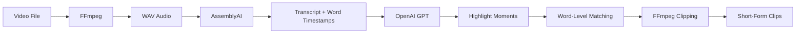

# 🎥 Longform-to-Shorts (v1)

[](https://www.python.org/)
[](https://fastapi.tiangolo.com/)
[](https://openai.com/)
[](https://www.assemblyai.com/)
[](https://ffmpeg.org/)

An intelligent pipeline that automatically extracts the most engaging highlight clips from long-form videos. It transcribes the video, uses an LLM to identify viral-worthy moments, and clips them into standalone short-form videos.

---

## 🚀 How It Works



1. **Audio Extraction** — FFmpeg extracts 16kHz mono WAV audio from the source video.
2. **Transcription** — AssemblyAI transcribes with word-level timestamps (cached via MD5 hash).
3. **Highlight Detection** — OpenAI GPT identifies 3–5 engaging, viral-worthy moments from the transcript.
4. **Segment Matching** — Verbatim LLM output is matched back to the transcript using word-level fuzzy matching for precise timestamps.
5. **Video Clipping** — FFmpeg clips and concatenates matched segments into highlight videos.

---

## ✨ Features

- **Dual Interface** — Use via **CLI** or **FastAPI REST API**
- **Word-Level Precision** — Timestamps are matched at the word level, not just sentence/segment level
- **Intelligent Caching** — MD5-based hashing skips re-transcription when the source file hasn't changed
- **Parallel LLM Calls** — Generate multiple highlight sets concurrently with async OpenAI calls
- **Overlap Merging** — Adjacent/overlapping segments are merged to prevent content replay in clips

---

## 📁 Project Structure

```text
whisper/
├── scripts/                 # Core pipeline modules
│   ├── main.py              # CLI entry point
│   ├── pipeline.py          # Reusable async pipeline function
│   ├── audio_processor.py   # FFmpeg audio extraction
│   ├── transcriber.py       # AssemblyAI transcription + caching
│   ├── llm_assistant.py     # OpenAI prompt building + async calls
│   ├── segment_matcher.py   # LLM output → transcript matching
│   ├── word_matcher.py      # Word-level fuzzy matching engine
│   └── video_clipper.py     # FFmpeg segment clipping + concatenation
├── server/                  # FastAPI REST API
│   ├── app.py               # App instance, CORS, health check
│   └── routes/
│       └── pipeline.py      # POST /api/process-video endpoint
├── experiments/             # Prototyping and earlier iterations
├── video/                   # Source video files (gitignored)
├── audio/                   # Extracted audio (gitignored)
├── clipped/                 # Output highlight clips (gitignored)
├── .cache/                  # Cached transcriptions (gitignored)
├── .env                     # API keys (gitignored)
└── requirements.txt
```

---

## 🛠️ Setup & Installation

### 1. Prerequisites

Ensure FFmpeg is installed:
```bash
# macOS
brew install ffmpeg

# Ubuntu/Debian
sudo apt update && sudo apt install ffmpeg
```

### 2. Environment Setup

```bash
python3 -m venv myenv
source myenv/bin/activate
pip install -r requirements.txt
```

### 3. Configuration

Create a `.env` file in the project root:
```env
OPENAI_API_KEY=your_openai_key
ASSEMBLYAI_API_KEY=your_assemblyai_key
```

---

## 📖 Usage

### CLI

Place your video in the `video/` directory and run:

```bash
python3 -m scripts.main --video video/your_video.mp4
```

**Options:**
| Flag | Default | Description |
|------|---------|-------------|
| `--video` | `video/ffmpeg.mp4` | Path to source video |
| `--n_answers` | `1` | Number of highlight sets to generate |
| `--model` | `gpt-4o-mini` | OpenAI model to use |
| `--temperature` | `0.7` | LLM creativity (0.0–2.0) |
| `--verbose` | off | Enable debug logging |

### API Server

Start the FastAPI server:
```bash
uvicorn server.app:app --reload
```

**Endpoints:**

| Method | Path | Description |
|--------|------|-------------|
| `GET` | `/api/health` | Health check |
| `POST` | `/api/process-video` | Process a video and extract highlights |

**Example request:**
```bash
curl -X POST http://localhost:8000/api/process-video \
  -H "Content-Type: application/json" \
  -d '{"video_path": "video/your_video.mp4", "n_answers": 1}'
```

Interactive API docs available at **http://localhost:8000/docs**

---

## 🚧 Status

The core pipeline (transcription → highlight detection → clipping) and the FastAPI server are stable. Future work includes video upload support and a frontend UI.
